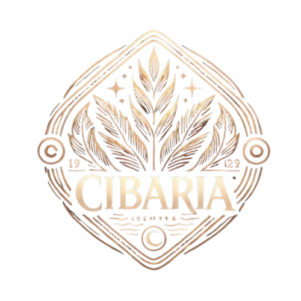

# 🍽️ Cibaria

**Cibaria** is a modern, full-stack recipe management application that brings culinary creativity to life. Built with Angular and Spring Boot, it provides a seamless platform for discovering, sharing, and managing recipes with friends and fellow food enthusiasts.



---

## ✨ Features

### 🔐 User Management
- **Secure Authentication**: Register and login with JWT-based security
- **User Profiles**: Personalized profiles with avatar and background images
- **Profile Settings**: Update username, description, email, and password

### 📖 Recipe Management
- **Create & Edit**: Rich recipe creation with ingredients, steps, and images
- **Image Upload**: Drag-and-drop image support with preview
- **Recipe Details**: Comprehensive recipe views with nutrition info
- **Recipe Rating**: 5-star rating system for community feedback
- **Favorites**: Save and organize your favorite recipes

### 🔍 Advanced Search & Filtering
- **Smart Filters**: Filter by difficulty, category, servings, and prep time
- **Search Functionality**: Find recipes by name or ingredients
- **Language Support**: Multi-language recipe content
- **Responsive Filters**: Mobile-optimized filter interface

### 🌍 Internationalization
- **Bilingual Support**: Complete English and Polish translations
- **Localized Units**: Smart unit translation (tsp → łyżeczka, etc.)
- **Dynamic Language Switching**: Seamless language changes

### 📱 Modern UI/UX
- **Responsive Design**: Optimized for desktop, tablet, and mobile
- **Toast Notifications**: Real-time feedback for user actions
- **Progressive Enhancement**: Smooth animations and transitions
- **Dark Theme**: Elegant dark color scheme

---

## 🏗️ Architecture

### Frontend (Angular 18.2.7)
```
frontend/
├── src/app/
│   ├── components/          # Reusable UI components
│   ├── services/           # API services and business logic
│   └── Interface/          # TypeScript interfaces
├── public/
│   ├── i18n/              # Translation files
│   └── images/            # Static assets
└── styles.css             # Global styles
```

### Backend (Spring Boot 3.4.1)
```
backend/
├── src/main/java/com/kk/cibaria/
│   ├── recipe/            # Recipe domain logic
│   ├── user/              # User management
│   ├── rating/            # Rating system
│   ├── auth/              # Authentication
│   └── config/            # Security & CORS config
└── resources/
    └── application.yml
```

---

## 🚀 Quick Start

### Prerequisites
- **Node.js** 18+ and npm
- **Docker** and Docker Compose

### Backend Setup (Docker)
1. **Clone and navigate:**
   ```bash
   git clone <repository-url>
   cd Cibaria
   ```

2. **Build and run with Docker:**
   ```bash
   docker compose build
   docker compose up
   ```
   Backend will start on `http://localhost:8080`

### Frontend Setup
1. **Navigate and install:**
   ```bash
   cd frontend
   npm install
   ```

2. **Start development server:**
   ```bash
   ng serve
   ```
   Frontend will start on `http://localhost:4200`

---

## 🔧 API Documentation

### Authentication
| Method | Endpoint | Description |
|--------|----------|-------------|
| POST | `/api/auth/register` | User registration |
| POST | `/api/auth/login` | User login |

### Recipes
| Method | Endpoint | Description |
|--------|----------|-------------|
| GET | `/api/recipes` | Get all recipes (with filters) |
| GET | `/api/recipes/{id}` | Get recipe by ID |
| POST | `/api/recipes` | Create new recipe |
| PUT | `/api/recipes/{id}` | Update recipe |
| DELETE | `/api/recipes/{id}` | Delete recipe |

### Users
| Method | Endpoint | Description |
|--------|----------|-------------|
| GET | `/api/users/profile` | Get user profile |
| PUT | `/api/users/profile` | Update profile |
| POST | `/api/users/favourites/{recipeId}` | Add to favorites |
| DELETE | `/api/users/favourites/{recipeId}` | Remove from favorites |

### Ratings
| Method | Endpoint | Description |
|--------|----------|-------------|
| POST | `/api/ratings` | Rate a recipe |
| GET | `/api/ratings/{recipeId}` | Get recipe ratings |

---

## 🛠️ Development

### Frontend Commands
```bash
# Development server
ng serve

# Build for production
ng build

# Generate component
ng generate component component-name
```

### Database Access
```bash
# Access database container
docker exec -it cibaria_database -h <REMOTE_HOST> -p <REMOTE_PORT> -U <DB_USER> <DB_NAME>
```

---

## 🌐 Internationalization

### Adding New Languages
1. Create new translation file: `frontend/public/i18n/{lang}.json`
2. Add language option in components
3. Update language service configuration

### Translation Structure
```json
{
  "NAV": {
    "HOME": "Home",
    "RECIPES": "Recipes"
  },
  "ADD_RECIPE": {
    "TITLE": "Add a new recipe",
    "UNITS": {
      "TSP": "tsp",
      "TBSP": "tbsp"
    }
  }
}
```

---

## 📱 Responsive Breakpoints

| Breakpoint | Width | Description |
|------------|-------|-------------|
| Mobile | < 460px | Small mobile devices |
| Mobile Large | 460px - 650px | Large mobile devices |
| Tablet | 650px - 1050px | Tablets and small laptops |
| Desktop | > 1050px | Desktop and large screens |